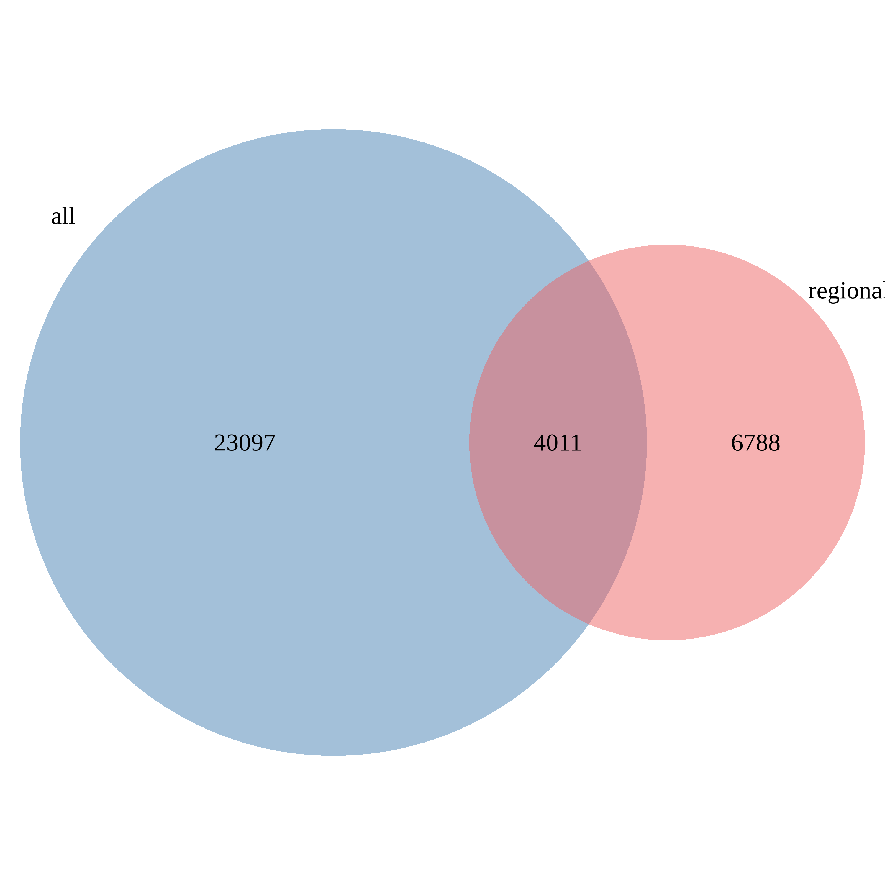

```{r, include=FALSE}
knitr::opts_chunk$set(echo=FALSE, message=FALSE, warning=FALSE)
```

```{r}
library(ggplot2)
library(dplyr)
library(knitr)
library(VennDiagram)
```

# Comparison of variants called using all reads vs regionally downsampled reads

```{r}
var1 = read.table('variantsInInsertions.SR.norm.tsv', as.is=TRUE, header=TRUE)
var2 = read.table('variantsInInsertions.SRRD.tsv', as.is=TRUE, header=TRUE)
```

## SNPs

```{r}
var1.snps = subset(var1, type=='SNV')
var2.snps = subset(var2, type=='SNV')

## Create ids and overlap for Venn diagram
var1.snps$var.id = paste(var1.snps$pos, var1.snps$seq, var1.snps$id, var1.snps$ins.gt, sep='_')
var2.snps$var.id = paste(var2.snps$pos, var2.snps$seq, var2.snps$id, var2.snps$ins.gt, sep='_')

vd = venn.diagram(list(all=var1.snps$var.id, regional=var2.snps$var.id),
             filename='venn-snps-all-regional.png', imagetype='png',
             col='transparent', fill=c('steelblue', 'indianred2'))
```



## Indels

```{r}
var1.indels = subset(var1, type!='SNV')
var2.indels = subset(var2, type!='SNV')

## Create ids and overlap for Venn diagram
var1.indels$var.id = paste(var1.indels$pos, var1.indels$seq, var1.indels$id, var1.indels$ins.gt, sep='_')
var2.indels$var.id = paste(var2.indels$pos, var2.indels$seq, var2.indels$id, var2.indels$ins.gt, sep='_')

vd = venn.diagram(list(all=var1.indels$var.id, regional=var2.indels$var.id),
             filename='venn-indels-all-regional.png', imagetype='png',
             col='transparent', fill=c('steelblue', 'indianred2'))
```


## Example of variants specific to the regional

```{r}
## Merge
var12 = merge(var1.snps, var2.snps, by=c('pos', 'seq', 'id', 'ins.gt', 'type', 'ins.chr', 'ins.pos', 'ins.size'), all=TRUE,
              suffixes=c('.all', '.region'))
var12$all = !is.na(var12$align.prop.match.all)
var12$regional = !is.na(var12$align.prop.match.region)
var12$n = as.numeric(var12$all) + as.numeric(var12$regional)

head(subset(var12, regional & !all)) %>% kable

subset(var12, id=='CHM1_chr1-25768072-INS-1091') %>% kable
subset(var12, id=='CHM1_chr11-102299023-INS-293') %>% kable
```

## Size distribution

```{r}
var12 = merge(var1.indels, var2.indels, by=c('pos', 'seq', 'id', 'ins.gt', 'type', 'ins.chr', 'ins.pos', 'ins.size'), all=TRUE,
              suffixes=c('.all', '.region'))
var12$all = !is.na(var12$align.prop.match.all)
var12$regional = !is.na(var12$align.prop.match.region)
var12$size = nchar(var12$seq)

var12$ol = ifelse(var12$all, 'all', 'regional')
var12$ol = ifelse(var12$all & var12$region, 'both', var12$ol)

ggplot(var12, aes(x=type, fill=factor(ol))) + geom_bar(position='fill') + theme_bw()

ggplot(var12, aes(x=size, fill=factor(ol))) + geom_histogram(binwidth=1, position='dodge') + theme_bw() + xlim(0,20)

var12 %>% group_by(ol) %>% mutate(tot=n()) %>%
  group_by(ol, size) %>% summarize(prop=n()/tot[1]) %>%
  filter(size<=20) %>% 
  ggplot(aes(x=size, y=prop, fill=factor(ol))) +
  geom_bar(stat='identity', position='dodge') + theme_bw() +
  scale_x_continuous(breaks=1:20) + ylab('proportion of indels')

```
