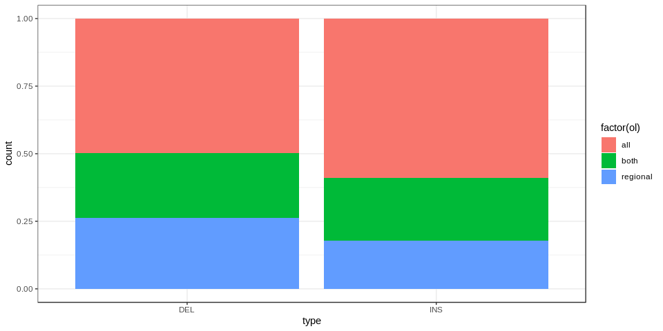
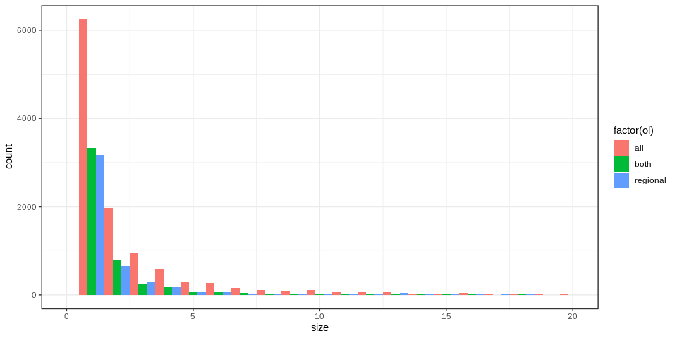
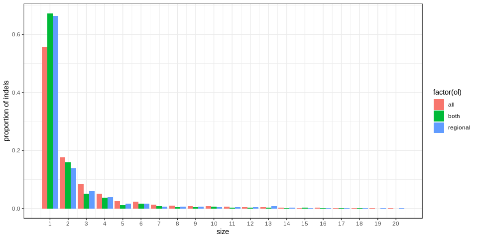
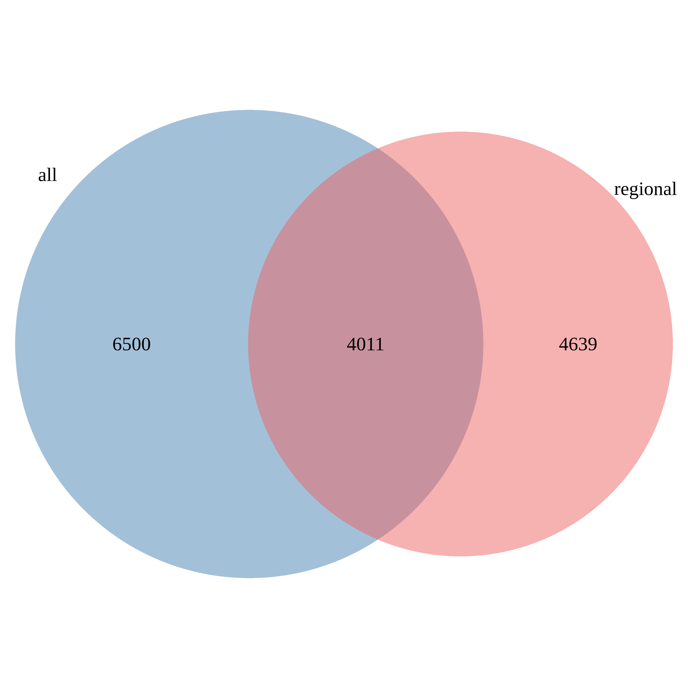
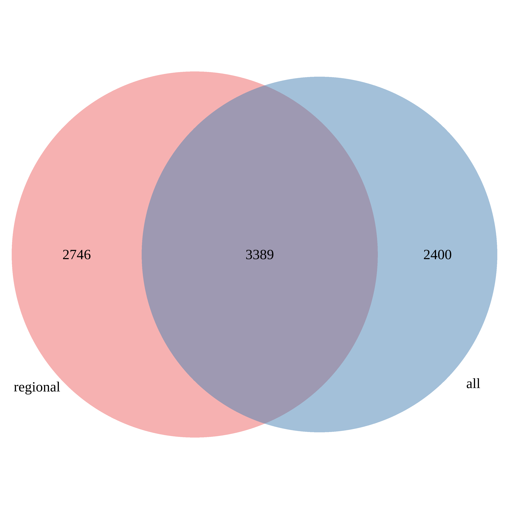

Comparison of variants called using all reads vs regionally downsampled reads
=============================================================================

All insertions
--------------

### SNPs

### Indels

### Example of variants specific to the regional

|     |  pos| seq    | id                            | ins.gt | type | ins.chr |    ins.pos|  ins.size|  align.prop.match.all| var.id.all |  align.prop.match.region| var.id.region                                 | all   | regional |    n|
|-----|----:|:-------|:------------------------------|:-------|:-----|:--------|----------:|---------:|---------------------:|:-----------|------------------------:|:----------------------------------------------|:------|:---------|----:|
| 6   |    1| A&gt;C | CHM1\_chr1-25768072-INS-1091  | het    | SNV  | chr1    |   25768061|      1091|                    NA| NA         |                   0.9853| 1\_A&gt;C\_CHM1\_chr1-25768072-INS-1091\_het  | FALSE | TRUE     |    1|
| 8   |    1| A&gt;C | CHM1\_chr1-31431806-INS-90    | het    | SNV  | chr1    |   31431806|        90|                    NA| NA         |                   0.9778| 1\_A&gt;C\_CHM1\_chr1-31431806-INS-90\_het    | FALSE | TRUE     |    1|
| 15  |    1| A&gt;C | CHM1\_chr1-8276877-INS-718    | het    | SNV  | chr1    |    8276877|       718|                    NA| NA         |                   0.9972| 1\_A&gt;C\_CHM1\_chr1-8276877-INS-718\_het    | FALSE | TRUE     |    1|
| 16  |    1| A&gt;C | CHM1\_chr10-111241952-INS-123 | het    | SNV  | chr10   |  111241952|       123|                    NA| NA         |                   0.9919| 1\_A&gt;C\_CHM1\_chr10-111241952-INS-123\_het | FALSE | TRUE     |    1|
| 25  |    1| A&gt;C | CHM1\_chr10-2501312-INS-126   | het    | SNV  | chr10   |    2501312|       126|                    NA| NA         |                   0.9603| 1\_A&gt;C\_CHM1\_chr10-2501312-INS-126\_het   | FALSE | TRUE     |    1|
| 32  |    1| A&gt;C | CHM1\_chr11-102299023-INS-293 | het    | SNV  | chr11   |  102299023|       293|                    NA| NA         |                   0.9966| 1\_A&gt;C\_CHM1\_chr11-102299023-INS-293\_het | FALSE | TRUE     |    1|

|       |   pos| seq    | id                           | ins.gt | type | ins.chr |   ins.pos|  ins.size|  align.prop.match.all| var.id.all                                     |  align.prop.match.region| var.id.region                                   | all   | regional |    n|
|-------|-----:|:-------|:-----------------------------|:-------|:-----|:--------|---------:|---------:|---------------------:|:-----------------------------------------------|------------------------:|:------------------------------------------------|:------|:---------|----:|
| 6     |     1| A&gt;C | CHM1\_chr1-25768072-INS-1091 | het    | SNV  | chr1    |  25768061|      1091|                    NA| NA                                             |                   0.9853| 1\_A&gt;C\_CHM1\_chr1-25768072-INS-1091\_het    | FALSE | TRUE     |    1|
| 36081 |   602| T&gt;C | CHM1\_chr1-25768072-INS-1091 | het    | SNV  | chr1    |  25768061|      1091|                    NA| NA                                             |                   0.9853| 602\_T&gt;C\_CHM1\_chr1-25768072-INS-1091\_het  | FALSE | TRUE     |    1|
| 36082 |   602| T&gt;C | CHM1\_chr1-25768072-INS-1091 | het    | SNV  | chr1    |  25768061|      1091|                    NA| NA                                             |                   0.9853| 602\_T&gt;C\_CHM1\_chr1-25768072-INS-1091\_het  | FALSE | TRUE     |    1|
| 36714 |   655| C&gt;A | CHM1\_chr1-25768072-INS-1091 | het    | SNV  | chr1    |  25768061|      1091|                0.9908| 655\_C&gt;A\_CHM1\_chr1-25768072-INS-1091\_het |                       NA| NA                                              | TRUE  | FALSE    |    1|
| 36715 |   655| C&gt;A | CHM1\_chr1-25768072-INS-1091 | het    | SNV  | chr1    |  25768061|      1091|                0.9908| 655\_C&gt;A\_CHM1\_chr1-25768072-INS-1091\_het |                       NA| NA                                              | TRUE  | FALSE    |    1|
| 40045 |  1020| C&gt;T | CHM1\_chr1-25768072-INS-1091 | het    | SNV  | chr1    |  25768061|      1091|                    NA| NA                                             |                   0.9853| 1020\_C&gt;T\_CHM1\_chr1-25768072-INS-1091\_het | FALSE | TRUE     |    1|
| 40046 |  1020| C&gt;T | CHM1\_chr1-25768072-INS-1091 | het    | SNV  | chr1    |  25768061|      1091|                    NA| NA                                             |                   0.9853| 1020\_C&gt;T\_CHM1\_chr1-25768072-INS-1091\_het | FALSE | TRUE     |    1|

|     |  pos| seq    | id                            | ins.gt | type | ins.chr |    ins.pos|  ins.size|  align.prop.match.all| var.id.all |  align.prop.match.region| var.id.region                                 | all   | regional |    n|
|-----|----:|:-------|:------------------------------|:-------|:-----|:--------|----------:|---------:|---------------------:|:-----------|------------------------:|:----------------------------------------------|:------|:---------|----:|
| 32  |    1| A&gt;C | CHM1\_chr11-102299023-INS-293 | het    | SNV  | chr11   |  102299023|       293|                    NA| NA         |                   0.9966| 1\_A&gt;C\_CHM1\_chr11-102299023-INS-293\_het | FALSE | TRUE     |    1|

### Size distribution

Insertions called in both runs
------------------------------

5977 insertions are called in both (out of 12858 called from the *all
reads* run, and 7597 called from the *regional downsample* run).

### SNPs

### Indels

