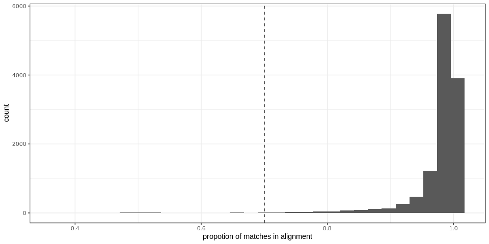
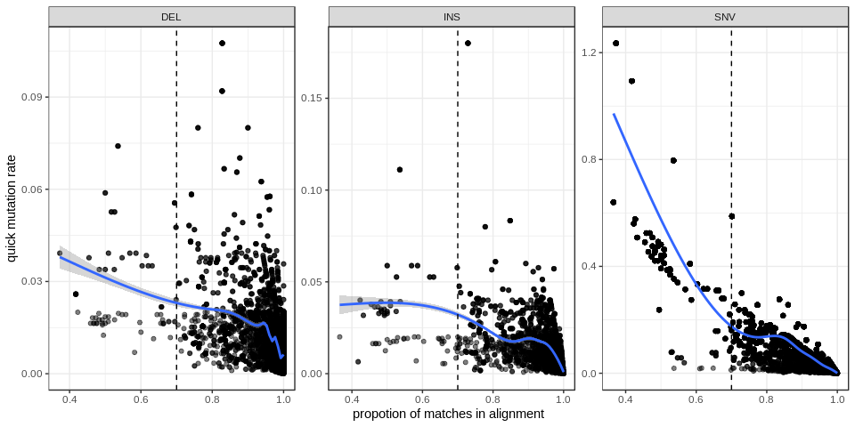

Quality control of the variants found from aligning inserted sequences
======================================================================

Alignment quality
-----------------

These calls are based on alignment of the inserted sequences (original
insertion vs called insertion that contains variants). Insertions were
first matched by location and size and then aligned. Even if they were
matched we might want to remove situations were the alignment was poor.
What should we use as threshold? Will it affect the mutation rate
experiment that we will use these variants for?

First, a look at the distribution of the alignment quality

We see a long tail. Could we use 0.7 as a minimum alignment identity?
Does it affect the mutation rate?

Using a quick calculation as `number of variants / insertion size`:

We could filter alignments that where below 70% identity. They might not
be trustworthy and the quickly estimated mutation rate plateaus around
this point so it shouldn’t affect the rest of the analysis that much.
