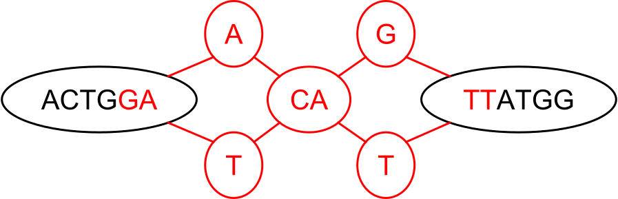
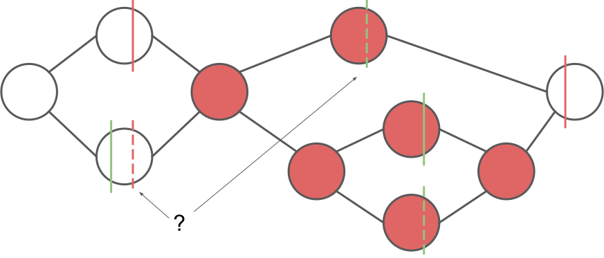
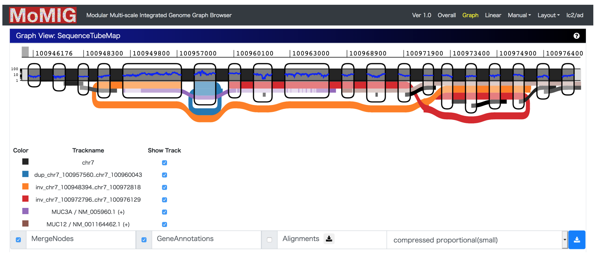

# Annotation in reference genome graphs

## Motivation

Current methods of annotating genomes rely on genomic intervals as a core formalism.
There are some difficulties in generalizing this formalism to reference graphs.
A genomic interval corresponds to a path in the graph.
However, if we restrict the annotation to one path in the graph, the alternate alleles included in the graph are not included in the annotation.
We argue that connected subgraphs are a more appropriate formalism for genome graphs.

Using a new core formalism for annotation necessarily means that there is not currently infrastructure built out to support it.
We need exchangeable representations of the data, software support, and analysis tools to make the formalism useful for practitioners.
This is what we are proposing to develop during this hackathon.

## Project

We are proposing to develop a proof-of-concept system for utilizing continuous-valued annotations with genome graphs. Our goals are to...

* Agree on a basic data representation for annotating subgraphs with continuous valued data
* Specify a human-readable file format for expressing the data representation
* Produce a demonstration set of annotation data for a genome graph
* Augment VG to produce and work with these data
* Hook the file format into an existing graph visualization tool

## Updates

### Day 2

#### Annotation Import - Easy Case



#### Annotation Import - Harder Cases



#### Gene-level RNAseq quantification pipeline

See the subproject-specific [README](gene_quant/README.md).

#### Visualization using MoMIG



#### The gGFF format

We have defined a generalization of the GFF3 format that replaces genomic intervals with a subraph. It is a text-based, tab-separated file. Every line contains each of the following fields. If a field is to be ignored, it can be replaced with a "." (without quotes). The fields are

* **subgraph**: a comma separated list of intervals of sequences on nodes, along with orientation in the format `ID[start:end](+/-/?)`. The interval is 0-based and exclusive for the end index. If the strand is given as "-", the interval begins at the reverse strand of the final base and extends toward the first base of the node.
* **source**: the name of the program or database that generated the annotation
* **type**: the type of feature
* **score**: a floating point value
* **phase**: 0, 1, or 2 indicating the first base of the feature that is a codon, measuring from the source node in the subgraph
* **attributes**: a semi-colon separated list of tag-value pairs, with tags separated from the values by an "="

Example:
```
156619[22:32]+,156620[0:32]+,156621[0:32]+,156622[0:2]+ havana  exon    .       .       Parent=transcript:ENST00000624081;Name=ENSE00003760288;constitutive=1;ensembl_end_phase=1;ensembl_phase=0;exon_id=ENSE00003760288;rank=1;version=1
156619[22:32]+,156620[0:32]+,156621[0:32]+,156622[0:2]+ havana  CDS     .       0       ID=CDS:ENSP00000485664;Parent=transcript:ENST00000624081;protein_id=ENSP00000485664
156643[3:32]+,156644[0:32]+,156645[0:32]+,156646[0:32]+,156647[0:15]+   havana  exon    .       .       Parent=transcript:ENST00000624081;Name=ENSE00003758404;constitutive=1;ensembl_end_phase=0;ensembl_phase=1;exon_id=ENSE00003758404;rank=2;version=1
```

#### Converting to gGFF from GFF3

We have built this capacity into the `vg` toolkit. The following invocation will inject the annotations from a GFF3 file into a graph:

```
vg annotate -x graph.xg -s graph.snarls -f annotations.gff3 -g > annotations.ggff
```

The snarls can be computed from a `.vg` file with the `vg snarls` subcommand, and the XG index can be created from a `.vg` file using the `vg index` subcommand.

## Team Members

* Travis Wrightsman (tw493@cornell.edu)
* Jordan Eizenga (jeizenga@ucsc.edu)
* Rajeeva Musunuri (rmusunuri@nygenome.org)
* Toshiyuki Yokoyama

## Future Directions

* local alignment of nodes could help resolve annotations that span outside of snarls
  * both distance or best alignment methods could be used to traverse the graph and liftover annotation from the reference path to other paths
