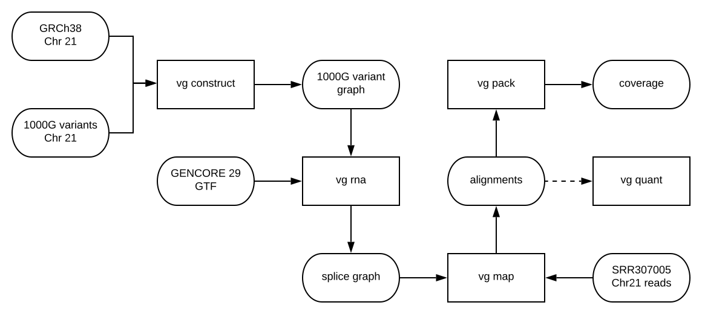

# Quantify RNAseq reads per gene

A common pipeline that researchers perform for differential expression analysis is mapping RNAseq reads to the graph and quantifying their counts per gene.
A useful graphical pangenome would also be able to perform this functionality while also enabling extra features like allele-specific transcription profiling.

## Pipeline

1. Construct a reference graph from chromosome 21 of GRCh38 and variants from the 1000 Genomes Project
2. Convert the graph to a splice-aware graph using `vg rna` and index it (running)
3. Map RNAseq reads to the graph (`vg map`)
4. Count coverage with `vg pack`
5. Quantify coverage per gene



## Example Output

```
WRB-SH3BGR    73.8200692500083
TTC3          133.6462585230295
CYP4F29P      1.3876541851910014
CLIC6         133.749223371102
APP           1.5401109307359306
PWP2          72.90841904197661
RPL3P1        1.2963362068965518
UBASH3A       4.138292362418783
AF127936.1    4.78666509136736
TFF2          0.8352272727272727
SON           474.0994757083457
```
